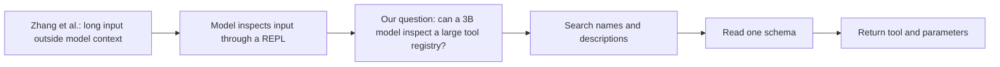
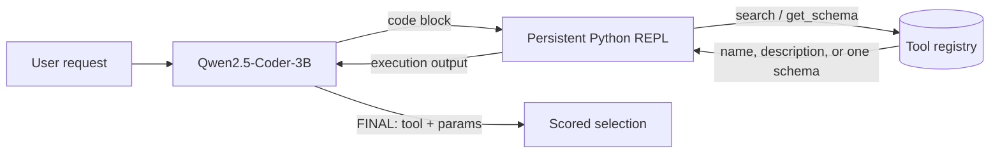
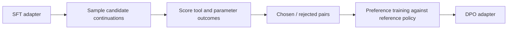
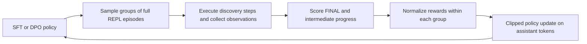

# RLM × MCP: Teaching a 3B model to discover tools

[Alex L. Zhang, Tim Kraska, and Omar Khattab's *Recursive Language Models*](https://arxiv.org/abs/2512.24601) place long input in an external environment and let a model inspect it through a Python REPL. We apply that idea to tool discovery: a small language model (SLM) searches an external MCP-style registry, reads the schema it needs, and returns a tool name with parameters. We train Qwen2.5-Coder-3B-Instruct to perform this sequence across multiple REPL turns.



The original RLM work also studies recursive model calls over document fragments. This project uses its external-context and REPL pattern for tool lookup; our agent does not implement recursive model calls. The registry exposes `list_names()`, keyword-based `search()`, and exact-name `get_schema()`. This keeps full schemas outside the prompt until the model asks for one.

## Agent and task

Given a request $x$ and registry $R=\{t_1,\ldots,t_n\}$, the agent must produce a tool $\hat t\in R$ and parameters $\hat p$. At turn $j$, its policy uses the request and the preceding code/observation history $H_j$ to choose the next REPL action: $a_j\sim\pi_\theta(a\mid x,H_j)$. The loop stops at `FINAL({"tool": ..., "params": {...}})` or its turn limit.



For example, the model can print `tools_registry.search("weather")`, inspect `tools_registry.get_schema("get_weather")`, then return `FINAL({"tool":"get_weather","params":{"city":"Tokyo"}})`. The [scaffold](src/scaffold.py) runs this loop; the [REPL engine](src/repl_engine.py) preserves variables between turns and truncates observations to fit the prompt budget. [Tool registry](src/tool_registry.py) implements lookup. The final tool is **selected, not executed** by the agent or the evaluator.

We evaluate three settings: **L0** supplies all tool names and descriptions in the prompt without a REPL; **L1** requires registry discovery with a constrained REPL; **L2** uses the larger discovery setting and a richer REPL. The same held-out queries support comparison across levels. The core pressure is prompt size: storing every schema costs roughly $n\bar s$ tokens for $n$ tools and mean schema length $\bar s$. On-demand lookup exposes only the schemas the model requests, plus search output and conversation history. It does not make the total cost independent of registry size or number of turns.

## Training

We built a 10,680-trajectory corpus from 2,500 adapted TOUCAN examples, 2,243 verified generated trajectories, and further augmentation and corrections. [Generation](src/generate_trajectories.py), [verification](src/verify_trajectories.py), [augmentation](src/augment_trajectories.py), and [split construction](src/build_splits.py) live in `src/`. Verification checks format, re-executes REPL code, and checks the selected tool and parameters; the LLM semantic judge is optional. The final split contains **8,584 train**, **1,043 dev**, and **1,053 test** trajectories.

### Supervised fine-tuning (SFT)


SFT learns the demonstrated search, schema inspection, and final-answer sequence. We mask user messages and REPL observations from the loss, so the model learns to produce actions rather than imitate environment output. For assistant-token mask $m_i$, the objective is $\mathcal L_{\mathrm{SFT}}=-\sum_i m_i\log\pi_\theta(y_i\mid y_{<i},x)/\sum_i m_i$. The [SFT notebook](notebooks/Phase_B_SFT.ipynb) contains the training run.

### Preference optimization (DPO)



The [pair builder](src/dpo_rejection_sampling.py) samples candidate responses and selects preferred and rejected completions. For prompt $x$, winner $y^+$, loser $y^-$, and reference policy $\pi_{\mathrm{ref}}$, sigmoid DPO minimizes

$$
\mathcal L_{\mathrm{DPO}}=-\log\sigma\!\left(\beta\left[\log\frac{\pi_\theta(y^+\mid x)}{\pi_{\mathrm{ref}}(y^+\mid x)}-\log\frac{\pi_\theta(y^-\mid x)}{\pi_{\mathrm{ref}}(y^-\mid x)}\right]\right).
$$

The repository also experiments with IPO and several preference sets; see the [DPO training driver](src/finetune_dpo.py) and [notebooks](notebooks/Phase_B2_DPO_v3.2.ipynb). DPO v3.1 contains 62 held-out queries in its training data. We report it only with that disclosure; [the cleaned v3.2 data](data/dpo_v3_2_clean/leakage_report.json) removes overlapping queries.

### Multi-turn reinforcement learning (GRPO)



The [custom GRPO loop](src/grpo_multiturn_train.py) grades complete episodes, from first search to `FINAL()` or timeout. It combines final-answer reward with a smaller intermediate signal: $r=r_{\mathrm{final}}+0.15r_{\mathrm{intermediate}}$. For each sampled group, it computes $A_i=(r_i-\bar r)/(\mathrm{std}(r)+\epsilon)$, drops groups without reward variation, and clips the policy-ratio objective. The [reward implementation](src/grpo_environment.py) scores answer format, tool identity, parameter keys, and parameter values. We also ran REINFORCE and PPO experiments; [the evaluation matrix](wiki/results/FINAL_EVAL_MATRIX.md) records their outcomes.

## Results

The canonical held-out evaluation has **1,053 queries**. The table uses percentages from the [evaluation summary](https://github.com/VedantShirgaonkar/RLM-research/blob/search-fix/results_final/EVALUATION_SUMMARY.md); the [local matrix](wiki/results/FINAL_EVAL_MATRIX.md) records the same run. All rows use Qwen2.5-Coder-3B as the base model. `pp` means percentage points.

| Model | L1 tool selection | L1 end-to-end | L2 tool selection | L2 end-to-end |
|---|---:|---:|---:|---:|
| Base | 51.38% | 29.91% | 35.04% | 18.14% |
| SFT | **88.51%** | **65.81%** | **87.84%** | **65.15%** |
| SFT → DPO v3 | 88.03% | 65.81% | 87.65% | 65.62% |
| SFT → DPO v3.2, later checkpoint | 88.32% | 66.95% | 66.48% | 49.76% |
| SFT → DPO v3.1 → GRPO | 88.22% | 66.57% | 85.28% | 64.48% |
| SFT → PPO v2 | 88.60% | 61.54% | 86.70% | 59.16% |

SFT supplies the main gain: **+35.90 pp L1** and **+47.01 pp L2** end-to-end over the base model. At L1, its average turn count falls from **4.43 to 3.24**, while timeout rate falls from **21.65% to 0.09%**. DPO v3 stays close to SFT. The cleaned DPO v3.2 checkpoint raises L1 end-to-end to 66.95% but loses substantial L2 accuracy. GRPO reaches 66.57% L1 end-to-end after a warm start from DPO v3.1, whose training leakage also affects that lineage. These are outcomes of this test set, not evidence that one fine-tuning method dominates across tasks.

| Metric | Scoring rule in this project |
|---|---|
| Tool selection (TSA) | Fraction of queries whose predicted tool name matches the expected name. |
| Parameter correctness (PC) | Fraction with all expected parameter keys and values present; value strings compare without case. |
| End-to-end (E2E) | Fraction with both the expected tool and matching expected parameters. This is a **selection-and-parameter proxy**, not a live tool-execution rate. |
| REPL code validity (RCV) | Mean per-query fraction of REPL code blocks that execute without error. |
| Turns / timeout | Mean model turns and fraction reaching the limit without a valid final answer. |

The [evaluator](src/evaluator.py) defines these metrics. On **50 queries from unseen TOUCAN registries**, SFT reaches **60% L1** and **52% L2** end-to-end, versus **16%** and **10%** for the base model ([OOD results](wiki/results/ood_results.md)). That set is small, so treat narrow differences between fine-tuned models with care. We also ran a [1,509-task MCPToolBench++ selection evaluation](wiki/results/mcptoolbench_cross_benchmark.md); its L0 base and L1 adapter conditions differ, so those numbers do not support a direct base-versus-adapter ranking.

## Run a local baseline

Install Python dependencies from [requirements.txt](requirements.txt), run [Ollama](https://ollama.com/), and pull `qwen2.5-coder:3b`:

```bash
python -m pip install -r requirements.txt
ollama pull qwen2.5-coder:3b
python -m src.run_baseline --level 1 --registry small_10
```

The command writes a timestamped JSON file under `results/`. `--level 0`, `--level 2`, `--registry medium_25`, and `--registry large_50` select the other local baseline settings. This CLI reads [the small fixed query set](test_data/queries/all_queries.json); it does **not** reproduce the 1,053-query canonical matrix. Training uses GPU dependencies and configuration in the linked notebooks and research notes, which `requirements.txt` does not install.

## Scope and research record

This repository studies **tool discovery and parameter selection**. Its registry search uses lexical matching, and the REPL runs model-generated Python in-process; use an isolated runtime before accepting untrusted code. The canonical evaluation records selection outcomes without invoking external MCP services. For experimental details, see the [research log](research/RESEARCH_LOG.md), [data pipeline](wiki/data/overview.md), [hyperparameters](wiki/hyperparameter_tables.md), and [audit](research/audit_2026_04_19/MASTER_AUDIT.md).
